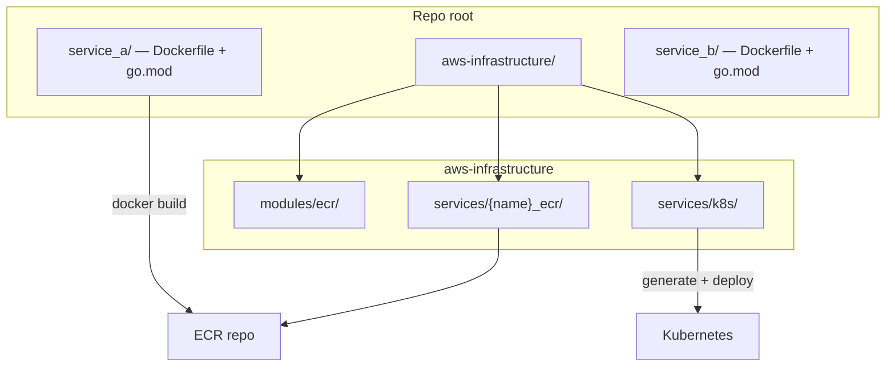

# Go language guidelines

## Quick reference

| Topic | Rule |
| ----- | ---- |
| Logging bootstrap | **`embedlog.ConfigLogger()`** at startup |
| Echo HTTP logging | **`embed-echo-log`** — `GetSLogHandler`, `SetLoggerWithRequestId`, `EmbedRequestLogger` |
| Request-scoped logs | **`x_request_id`** on every API-request log |
| Logger access | **`zerolog.Ctx(ctx)`** — not constructor injection |
| Sensitive data | Mask with **`*******`**; never log listed secrets/PII |
| Readability order | clarity → simplicity → concision → maintainability → consistency |
| Line length | **~88 columns** soft target (not a hard limit) |
| Line comments | **`//` only** — never `/* */` block comments |
| Optional function params | Pointer types (`*int`, `*string`); `nil` = unset |
| Maps/slices across goroutines | Do not share — copy, channel handoff, or single owner |
| Goroutine lifecycle | Owner + shutdown for **long-lived** goroutines; limited-lifetime fan-out OK with `wg.Go` |
| Channel close | Sender closes after last send; receivers never `close` |
| Sleep for sync | No `time.Sleep` for production coordination |
| WaitGroup | Use `sync.WaitGroup` for fan-out work |
| WaitGroup goroutines | Prefer `wg.Go(fn)` over manual `Add`/`Done` |
| `errgroup` | Do not use `golang.org/x/sync/errgroup` — not stdlib |
| `gofmt` | Run **`go fmt ./...`** (or `gofmt -w .`) on all Go source |
| `.go` filenames | `snake_case` (`webhook_handler.go`) |
| Directories in module | `snake_case` (`internal/webhook_handler/`) |
| Module path (`go mod init`) | `kebab-case` (`subscription-webhook`) |
| Identifiers in code | `MixedCaps` / `mixedCaps` |
| Constants | `MaxRetries`, not `MAX_RETRIES` |
| Import aliases | `camelCase` (`httpClient`) when needed |
| Package names | Prefer single word; 2+ words → `snake_case` (`grpc_client`) |
| Optional struct fields | Pointer types |
| Control flow | Prefer `switch` over long `if` chains |
| Errors | Inline `if err := fn(); err != nil` |
| Domain errors | Typed `DomainError`; map at transport with `errors.As` |
| Error wrapping | `%w` once; `errors.Is` / `errors.As`; no string compare |
| Money / decimals | Never `float32`/`float64`; minor units, decimal VO, or string |
| Timestamps | UTC storage; RFC3339Nano on APIs; `timestamptz` in DB |
| `panic` | Never in final/production code |
| Functions vs methods | Prefer package functions; methods when required |
| Struct + methods | Private struct + `NewXxx` constructor + interface |
| Method receivers | `*T` consistently on mutable types |
| `*Interface` | Never (`io.Reader`, not `*io.Reader`) |
| `*[]T`, `*chan T` | Never |
| Function docs | Doc comment on **every** function |
| Dependencies | Std lib before new deps |
| Layout | `cmd/` / `internal/` / optional `pkg/` |
| Microservice layout | Hexagonal `internal/` layers (`app`, `domain`, `dto`, `adapters`) |
| Import direction | `domain` → stdlib only; `app`/`adapters` → `domain` + `dto`; no HTTP/SQL in `domain` |
| Domain aggregates | Domain nouns; aggregate fields **`string`** in examples |
| Commands/queries | Action-oriented struct names (`CreateXxxCommand`, `GetXxxQuery`) |
| Interface naming | Consumer-side; role names; no `I*` / `*Interface` / `Impl` |
| Package naming | No `utils`, `common`, `helpers`, `models`, `repositories`; no stutter on exports |
| Server projects | Logic in `internal/`, binaries in `cmd/` |
| Multiple servers | One module, many `cmd/<server>/` |
| Nested monorepo | Separate `go.mod`; **no `go.work`** |
| AWS infrastructure | Repo-root `aws-infrastructure/` with `modules/ecr`, `services/{service}_ecr`, `services/k8s` |
| K8s manifests | Single `aws-infrastructure/services/k8s/configs/{service}/deployment.yaml` |
| Dockerfile | `Dockerfile` at module root; one per nested module |
| Build tags | Regions `mena`, `asia`, `us`, `europe` |
| Consistency | Match neighbors; `snake_case` filenames win when styles conflict |

---

## Style principles

Readable Go code is ordered by importance:

1. **Clarity** — Purpose and rationale are clear. Achieved through naming, commentary, and organization. Prioritize the reader over the author.
2. **Simplicity** — Simplest code that meets goals. Easy to read top-to-bottom; no unnecessary abstraction; comments explain **why**, not what.
3. **Concision** — High signal-to-noise. Use common idioms (`if err := …`). Table-driven tests factor repetition.
4. **Maintainability** — Easy to change correctly. Predictable names; minimal dependencies; explicit edge cases.
5. **Consistency** — Matches neighboring code in package, directory, or team — but does not override principles above.

### Clarity

- Ask: **What** is the code doing? **Why** is it doing that?
- Improve clarity with better names, focused comments, whitespace, and smaller functions.
- Avoid redundant comments that repeat the code. Let names speak; comment non-obvious **why**.
- Standout code should do so for a good reason (often performance). Document that reason.

### Simplicity and least mechanism

Prefer the most standard tool that works:

1. Core language construct (slice, map, channel, loop, struct)
2. Standard library
3. Shared internal library
4. New dependency

Prefer the **simplest** mechanism; **standard library before new dependencies**.

### Concision

- Remove repetitive code; use tables or helpers when repetition obscures differences.
- The common error-check idiom is immediately recognizable:

```go
if err := doSomething(); err != nil {
    // handle error
}
```

- When inverting the check (`err == nil`), add a comment to boost signal:

```go
if err := doSomething(); err == nil { // if NO error
    // ...
}
```

### Maintainability

- Make critical single-character differences explicit (e.g. `=` vs `:=`, easy-to-miss `!`).
- Prefer breaking complex conditions into named booleans with a short comment.
- Interfaces have a cost — use when abstraction earns its keep.
- Minimize dependencies; avoid undocumented behavior of dependencies.

### Consistency

- Package-level consistency matters most.
- When this guide is silent, match **neighboring code** in the same package or directory.
- Valid local choices: `%s` vs `%v` for errors, buffered channels vs mutexes.
- Invalid local choices: undocumented line-length fights, assertion libraries against team standards.
- Use **`snake_case` `.go` filenames`** when filename style conflicts with other conventions.
- If local style disagrees with this guide but impact is one file, fix in a follow-up when practical.
- Do not worsen existing deviations in new code — at minimum, do not expand bad patterns.

---

## Formatting and line length

- Run **`go fmt ./...`** (or **`gofmt -w .`**) on all Go source. Do not fight the formatter.
- Generated code should also be formatted (`format.Source` or `gofmt`).
- Use **tabs** for indentation (`gofmt` default).
- Go needs fewer parentheses than C/Java; rely on operator precedence and spacing.

### Formatting checks (required)

Every service must format Go source with **`go fmt`** before commit and in CI.

Run:

```bash
go fmt ./...
```

Equivalent:

```bash
gofmt -w .
```

Pair with:

```bash
go test ./...
go vet ./...
```

Do not fight the formatter. Generated code must also be formatted (`gofmt` or `go/format.Source`).

Aim for a **soft target of ~88 columns** — prefer wrapping or refactoring when a line approaches 88 characters. This is a **team review guideline, not a hard limit**; occasional longer lines are acceptable when breaking them would hurt readability (long string literals, struct tags, generated code). `gofmt` does not enforce column width.

If a line feels too long, **refactor first**; do not split before an indentation change or to break a long URL string artificially.

### Semicolons

The Go lexer inserts semicolons at line ends in specific cases. You rarely type `;`. This is why `gofmt`'s brace and newline rules matter — broken formatting can change meaning.

---

## Naming

### Identifiers in source (MixedCaps)

- Use **`MixedCaps`** / **`mixedCaps`** for multi-word names in code — not `snake_case` (`MaxRetries`, `parseConfig`).
- Exported names start with uppercase; unexported with lowercase.
- Package names: **prefer a single word**; see [Package naming rules](#package-naming-rules) when multi-word names are unavoidable.
- Names should not feel repetitive in context; do not repeat concepts already clear from package or receiver names.
- Single-method interfaces may use **`-er`** suffix: `Reader`, `Writer`, `Formatter`.
- Avoid stutter: `package tab; tab.TabReader` → prefer name that reads well at call site.

### Package naming rules

Package names must be **short, lowercase, and singular** where practical.

**Always prefer single-word** package names (`order`, `postgres`, `client`).
When one word is not enough:

- **Three or more words** — use **`snake_case`** (`order_event_subscriber`).
- **Two words** (only when a single word is not accurate) — use **`snake_case`** (`grpc_client`), not mashed lowercase (`grpcclient`).

The package name must match the directory base name.

| Word count | Rule | Examples |
| ---------- | ---- | -------- |
| **1 word** (preferred) | Plain lowercase | `order`, `query`, `postgres`, `client`, `observability` |
| **2 words** (avoid if possible) | Prefer collapsing to one word; if unavoidable → **`snake_case`** | Prefer `client` over `grpc_client`; if both words needed → `grpc_client` not `grpcclient` |
| **3+ words** | **`snake_case`** required | `order_event_subscriber`, `ref_cursor_mapper` |

Preferred (single word) and when multi-word is required:

```text
order                           grpc_client          not grpcclient
postgres                        order_event_sub     not orderevent_subscriber
client                          webhook_handler      not webhookhandler
```

Avoid:

```text
orders
utils
common
helpers
models
repositories
grpcclient
webhookhandler
```

Rules:

1. A package name must describe the behavior or boundary it owns.
2. Do not create generic `utils`, `common`, or `shared` packages — see also [Project structure — Standard GTN layout rules](#standard-gtn-layout-rules).
3. Prefer small cohesive packages over broad packages with unrelated functions.
4. Package-level exported names must not stutter.

Good:

```go
// Preferred — single word
package postgres

// Two words unavoidable; matches directory internal/adapters/grpc_client/
package grpc_client

// Three or more words
package order_event_subscriber

package order

type Repository interface {
    Save(ctx context.Context, tx Tx, aggregate *Aggregate) error
}
```

Bad:

```go
package grpcclient

package order

type OrderRepository interface {
    SaveOrder(ctx context.Context, order *OrderAggregate) error
}
```

### File names

Multi-word `.go` files use **`snake_case`**: `webhook_handler.go`, `subscription_repo.go`. Do not mash words (`webhookhandler.go`). Tests: `foo_test.go` beside `foo.go`.

### Constants

Use **MixedCaps** / **mixedCaps** for constants. **Never `ALL_CAPS` or `SCREAMING_SNAKE_CASE`.**

Good:

```go
const MaxRetries = 3
const defaultTimeout = 30 * time.Second
```

Avoid:

```go
const MAX_RETRIES = 3
const DEFAULT_TIMEOUT = 30 * time.Second
```

### Import aliases

When an import alias is required, use **`camelCase`** (`mixedCaps`, lowercase first letter).

Good:

```go
import (
    httpClient "net/http"
    jsonCodec "encoding/json"
)
```

Avoid:

```go
import (
    http_client "net/http"
    HTTPClient "net/http"
)
```

Do not use `import .` except in rare test scenarios. Avoid unnecessary aliases when the default package name is clear.

---

## Commentary and documentation

- Use **`//` line comments** for all commentary — doc comments, package comments, and inline notes.
- Doc comments appear **directly above** top-level declarations with **no blank line** between.
- **Exported** symbols: godoc comment **starts with the symbol name**.
- Explain **why** or non-obvious behavior; skip line-by-line repetition.
- Keep comments **brief** — one or two sentences; link specs or algorithms instead of long prose.
- Package comment in `doc.go` or atop the main package file.

### Line comments only (required)

**Never use block comments (`/* */`).** Always use **`//` line comments** — including package comments in `doc.go`.

Good — package comment in `doc.go`:

```go
// Package webhook_handler processes subscription webhooks for GTN services.
// It validates payloads and forwards events to downstream processors.
package webhook_handler
```

Good — inline note:

```go
// skip empty payloads — upstream sends heartbeat messages with no body
if len(payload) == 0 {
    return nil
}
```

Avoid:

```go
/* Package webhook_handler processes subscription webhooks. */
package webhook_handler

/* TODO: handle retries */

/*
 * Multi-line block comment
 * explaining obvious behavior
 */
```

### Function documentation (required)

**Every function** (exported and unexported) must have a doc comment directly above it.

Exported — godoc form:

```go
// ParseConfig reads service configuration from path.
func ParseConfig(path string) (*Config, error) { ... }
```

Unexported — concise purpose:

```go
// parseTimeout converts raw seconds to a duration.
func parseTimeout(seconds int) time.Duration { ... }
```

Avoid functions with no preceding comment.

---

## Type and interface naming

Domain types and interfaces should read naturally at call sites and keep transport concerns out of core logic.

### Domain structs

Use **domain-specific nouns** for aggregates and entities.

Use **`string`** for aggregate fields in convention examples (not custom value-object types).

```go
type Aggregate struct {
    id         string
    accountID  string
    instrument string
    side       string
    status     string
    quantity   string
    limitPrice string
}
```

Application **commands** and **queries** use action-oriented exported struct names. Fields may use `string` at transport boundaries:

```go
type CreateOrderCommand struct {
    Principal      identity.Principal
    AccountID      string
    InstrumentID   string
    Side           string
    Quantity       string
    LimitPrice     string
    IdempotencyKey string
}

type GetOrderQuery struct {
    Principal identity.Principal
    OrderID   string
    AccountID string
}
```

**Exception:** Plain data carriers without receiver methods (commands, queries, DTOs) may use exported structs — no constructor required unless validation is needed. See [Private struct + public constructor](#private-struct--public-constructor).

### Interface naming

Define interfaces at the **consumer** side, not the implementation side.

Good:

```go
package service

type AccountAuthorizer interface {
    CanTrade(ctx context.Context, principal identity.Principal, accountID string) error
}
```

Bad:

```go
package grpc_client

type AccountClientInterface interface {
    CanTrade(ctx context.Context, accountID string) (bool, error)
}
```

Interface naming rules:

1. Single-method interfaces may use **`-er`**: `Publisher`, `Clock`, `IDGenerator`.
2. Multi-method interfaces use the **role name**: `Repository`, `TxManager`, `AccountAuthorizer`.
3. Avoid `IRepository`, `RepositoryInterface`, or `Impl` suffixes.

---

## Project structure

GTN adopts standard Go module layouts with **`snake_case` directories** and **`snake_case` `.go` files**.

### Architectural principles

Every service should look familiar to engineers moving between bounded contexts. Code should make domain behavior explicit, isolate infrastructure concerns, and keep request, persistence, and messaging details out of core business logic.

### Decision guide

| Project type | Layout |
| ------------ | ------ |
| Library + commands | Packages and commands |
| Deployable API microservice | Unified hexagonal layout |
| Web / API server (simple) | Server project |
| Multiple servers, one module | Server project + multiple `cmd/` |
| Nested monorepo | Independent modules, no workspace |

### Packages and commands in the same repository

Baseline for a module with importable packages **and** binaries:

```
project_root/
  go.mod
  go.sum
  auth/                         # optional importable package (or use pkg/)
    auth.go
  internal/
    subscription_webhook/
      handler.go
  cmd/
    webhook_worker/
      main.go
    report_generator/
      main.go
```

- Import: `github.com/gtn-group/my-service/auth`
- Install: `go install github.com/gtn-group/my-service/cmd/webhook_worker@latest`

### Deployable service layout (hexagonal)

For **deployable API microservices**, combine the server-project baseline with hexagonal layers under `internal/`. Server logic stays in **`internal/`**; all Go binaries in **`cmd/`**; non-Go assets outside those trees.

Module path uses **`kebab-case`** (`github.com/gtn-group/order-service`); in-repo directories use **`snake_case`**; transport ports live in **`internal/dto/`**.

```
order_service/                    # repo root; module github.com/gtn-group/order-service
  Dockerfile                      # container image for this module
  cmd/
    order_service/
      main.go                       # wiring, graceful shutdown
  internal/
    app/
      command/
        create_order.go
      query/
        get_order.go
      service/
        order_application_service.go
    domain/
      order/
        aggregate.go
        repository.go
    dto/
      http/
        handlers/
          order_handler.go
      grpc/
      nats/
      persistence/
        tx_manager.go
    adapters/
      postgres/
        order_repository.go
      nats/
      grpc_client/
      clock/
      idgen/
    config/
      config.go
    observability/
      logger.go
  pkg/
    gen/api/order/v1/               # generated protobuf
    client/order/v1/                # public client for other services
  api/
    proto/order/v1/order.proto
    openapi/order.v1.yaml
  db/
    migrations/
  test/
    integration/
  go.mod
  go.sum
  Makefile
```

Simpler services may use flat **`internal/<feature>/`** (see [Packages and commands](#packages-and-commands-in-the-same-repository)) when hexagonal layers are unnecessary.

### Multiple web servers in one module

**One `go.mod`**, multiple HTTP/gRPC servers as separate commands under `cmd/`. Shared handlers, middleware, and domain logic live in `internal/` — not duplicated per command.

```bash
go build -o bin/api_server ./cmd/api_server
go build -o bin/admin_server ./cmd/admin_server
```

### Web servers

- Use `net/http` handlers; `func(w http.ResponseWriter, r *http.Request)` or types implementing `ServeHTTP`.
- `http.ListenAndServe(addr, handler)` blocks; pass `nil` handler for `DefaultServeMux` or a custom `ServeMux`.
- Register handlers before calling `ListenAndServe`; use `http.Handle` / `HandleFunc` or explicit `ServeMux`.
- For production servers, prefer structured shutdown (`Server.Shutdown`) and place wiring in `cmd/<server>/main.go`.
- For Echo v5 HTTP servers, use **`embed-echo-log`** for framework and access logging (see [Structured logging](#structured-logging)).

### Standard GTN layout rules

| Directory | Responsibility | Import rule |
| --- | --- | --- |
| `cmd/<service>/` | Process entrypoint, dependency wiring, graceful shutdown | May import `internal/*` and generated `pkg/` code |
| `internal/domain/` | Aggregates, value objects, domain services, domain errors, repository **interfaces** | Must not import adapters, HTTP, gRPC, NATS, SQL drivers, or K8s packages |
| `internal/app/` | Use cases, command/query handlers, transaction orchestration | May import domain and dto; must not depend on concrete adapters |
| `internal/dto/` | Interface definitions and transport contracts at service boundary | May define HTTP/gRPC/NATS interfaces and middleware contracts |
| `internal/adapters/` | Concrete infra: Postgres, NATS, external gRPC clients, ID generators | May import domain and dto |
| `internal/config/` | Environment parsing and runtime config validation | Must not contain business logic |
| `internal/observability/` | Logger, metrics, tracing setup | Shared only inside the service |
| `internal/<feature>/` | *(simpler projects)* Feature-grouped private packages | Avoid import cycles; see [Package naming rules](#package-naming-rules) |
| `pkg/` | Public generated clients and reusable APIs for other services | Backward-compatible; reviewed as public API |
| `api/` | Protobuf and OpenAPI source contracts | Source of truth for generated artifacts |
| `db/migrations/` | SQL migrations (e.g. golang-migrate) | Forward-only in production |
| `Dockerfile` | Container image build for this module | Module root only; build context = module root |
| `aws-infrastructure/` | Repo-root AWS IaC — ECR Terraform and K8s deploy generator | Non-Go; not imported by Go modules |
| `aws-infrastructure/modules/ecr/` | Reusable ECR Terraform module | Shared by all `{service}_ecr` stacks |
| `aws-infrastructure/services/{service}_ecr/` | Per-service ECR Terraform stack | One stack per deployable Go module |
| `aws-infrastructure/services/k8s/` | K8s deployment generator (`main.py`, configs, env files) | Generates manifests from templates |
| `aws-infrastructure/services/k8s/configs/{service}/deployment.yaml` | Single multi-doc K8s manifest for this service | All objects (`---` separated); `${VAR}` placeholders |
| *(all)* | Colocate tests: `foo_test.go` beside `foo.go`; `testdata/` for fixtures | — |

**General rules:**

- **`cmd/`** — One small `main` per binary: `cmd/<app_name>/main.go`.
- **`internal/`** — Private to this module; not importable externally.
- **`pkg/`** (optional) — Public reuse; omit if everything is app-specific.
- Group by **feature or bounded context** when not using hexagonal layers.
- Shared types at the **lowest** sensible layer; avoid import cycles.

### Import direction

Allowed dependency direction for **deployable microservices**:

```text
cmd
  -> internal/config
  -> internal/observability
  -> internal/app
  -> internal/domain
  -> internal/dto
  -> internal/adapters

internal/adapters -> internal/domain and internal/dto
internal/app      -> internal/domain and internal/dto
internal/domain   -> standard library only, plus approved decimal/time primitives
```

Forbidden dependency examples:

```go
// Forbidden: domain must not know about HTTP.
package order

import "net/http"

// Forbidden: domain must not know about pgx.
import "github.com/jackc/pgx/v5"
```

Hexagonal import direction is the **normative rule for deployable microservices**. Simpler flat layouts still avoid cycles but are not required to use the `domain` / `dto` / `adapters` split.

### Nested monorepo (multiple modules)

Each nested project has its **own `go.mod`**. **Do not use `go.work`** at repo root or between modules.

```
monorepo_root/
  aws-infrastructure/           # shared AWS IaC for all deployable modules
    modules/
      ecr/
    services/
      subscription_webhook_ecr/
      payment_gateway_ecr/
      k8s/
        main.py
        configs/
          subscription_webhook/
            deployment.yaml
          payment_gateway/
            deployment.yaml
          envs/
            dev.env
            qa.env
  subscription_webhook/
    Dockerfile                  # container image for subscription-webhook module only
    go.mod                      # module github.com/gtn-group/subscription-webhook
    cmd/api_server/main.go
    internal/...
  payment_gateway/
    Dockerfile                  # container image for payment-gateway module only
    go.mod                      # module github.com/gtn-group/payment-gateway
    cmd/api_server/main.go
    internal/...
```

Cross-module deps use `require` / `replace` in each module's `go.mod`. **Avoid** `go.work` and `use (...)` workspace files.

- **Shared repo-root `aws-infrastructure/`** for all deployable modules — one `{service}_ecr` stack and one `k8s/configs/{service}/` directory per module.
- **No monorepo-root `Dockerfile`** when modules are independent — each module owns its image build.
- **No `deploy/k8s/`** under Go modules — use centralized `aws-infrastructure/`.
- **`docker build` context** is always the **nested module directory** containing that module's `go.mod` and `Dockerfile`.

### AWS infrastructure

Every repository with deployable services must include `aws-infrastructure/` at the **repository root**.

- **`modules/ecr/`** — reusable Terraform module for ECR repositories (scan on push, lifecycle policy keeping max 10 images).
- **`services/{service}_ecr/`** — one Terraform stack per deployable service; provisions that service's ECR repo.
- **`services/k8s/`** — K8s deployment automation (`main.py`, per-service configs, per-env `.env` files).

Do **not** place K8s manifests under Go module `deploy/k8s/`.

**Reference directory tree** — adapt `{service}` names per project:

```text
aws-infrastructure/
  modules/
    ecr/
      main.tf              # aws_ecr_repository + lifecycle policy (max 10 images, scan on push)
      variables.tf
  services/
    {service}_ecr/         # one Terraform stack per deployable service (e.g. ws_ecr, sse_ecr)
      main.tf              # module "ecr" { source = "../../modules/ecr" ... }
      variables.tf
      locals.tf            # resource_suffix, common_tags, env_tags
      backend.tf           # terraform { backend "s3" {} }
      envs/
        dev.tfvars
        qa.tfvars
        ...                # one .tfvars per GTN environment
    k8s/
      main.py              # deployment generator (iac-utils, python-dotenv)
      requirements.txt
      configs/
        {service}/
          deployment.yaml  # single multi-doc K8s manifest (Deployment, HPA, Service, HTTPRoute — --- separated)
        envs/
          {env}.env        # per-environment values for ${VAR} placeholders
```

**Naming conventions:**

| Asset | Pattern | Example |
|-------|---------|---------|
| ECR repository | `ecr-{region_abbr}-{bu_abbr}-{env}-{pv_abbr}-{service}-01` (lowercase) | `ecr-mb-gma-dev-fiam-ws-01` |
| ECR Terraform dir | `{service}_ecr` | `ws_ecr` |
| K8s config dir | `configs/{service}/` | `configs/ws/` |
| K8s manifest file | `deployment.yaml` (not split files) | multi-doc with `---` |

#### ECR Terraform

- **`modules/ecr/main.tf`:** `aws_ecr_repository` named `ecr-{resource_suffix}-{resource_name}-01` (lowercase); `image_scanning_configuration.scan_on_push = true`; lifecycle policy expiring when image count exceeds 10.
- **`services/{service}_ecr/main.tf`:** calls `module "ecr"` with `source = "../../modules/ecr"`, `resource_name = "{service}"`.
- **`locals.tf`:** `resource_suffix = upper("{region_abbr}-{bu_abbr}-{env}-{pv_abbr}")`; standard GTN tags (`ApplicationName`, `CostCenter`, `Environment`, `Automation = Terraform`, etc.).
- **`backend.tf`:** `terraform { backend "s3" {} }`.
- **`envs/*.tfvars`:** one file per environment (`dev`, `qa`, `sbx`, regional prod/uat variants) with `region`, `region_abbreviation`, `bu_abbreviation`, `env`, `product_vertical_abbr`, `ecr_force_delete`, `source_tag`.

#### K8s deployment generator

- **`services/k8s/main.py`:** reads `_SELECTED_ENV`, `SERVICE_NAME`, `APP_VERSION`; loads `configs/envs/{env}.env`; resolves ECR image URL; generates final manifest via `fs.generate_files(configs/{service}/deployment.yaml, deployment.yaml)`.
- **`configs/{service}/deployment.yaml`:** single file, all K8s objects (`---` separated); `${VAR}` placeholders for env-specific values (replicas, resources, image URL, endpoints).
- **`requirements.txt`:** `iac-utils` (GitLab PyPI), `python-dotenv`.
- Same object types as prior GTN examples: Deployment, HPA, Service, HTTPRoute.

**CI integration** (reference only — do not copy full `.gitlab-ci.yml`): per-service pipeline stages — (1) ECR Terraform via `Terraform/.gitlab-ci.yml`, (2) Docker build/push, (3) K8s deploy via `Python-K8s/.gitlab-ci.yml` with `K8S_PATH`, `SERVICE_NAME`, `_SELECTED_ENV`.



### Deployment

Deployment splits into **container build** (per Go module) and **AWS deploy assets** (repo-root `aws-infrastructure/`).

**Container build** (per Go module):

- **`Dockerfile`** — at the **module root** (next to `go.mod`). Builds the container image for this module. One Dockerfile per module; do not share a root Dockerfile across modules.
- Build context for `docker build` is the **module root** (where `go.mod` and `Dockerfile` live).

**AWS deploy assets** (repo root — see [AWS infrastructure](#aws-infrastructure)):

- **`aws-infrastructure/modules/ecr/`** — shared ECR Terraform module.
- **`aws-infrastructure/services/{service}_ecr/`** — per-service ECR provisioning.
- **`aws-infrastructure/services/k8s/configs/{service}/deployment.yaml`** — **single file** containing **all** Kubernetes objects for this service (Deployment, HPA, Service, ServiceAccount, ConfigMap/Secret references, HTTPRoute, etc.). Use YAML document separators (`---`) between resources and `${VAR}` placeholders for env-specific values. Do **not** split into separate `deployment.yaml`, `service.yaml`, `httproute.yaml` files under Go modules.

**Example repo layout:**

```text
my-project/
  aws-infrastructure/           # GTN AWS IaC (required for deployable services)
    modules/ecr/
    services/
      payment_gateway_ecr/
      k8s/configs/payment_gateway/deployment.yaml
  payment_gateway/              # Go module
    go.mod
    Dockerfile
    cmd/ ...
    internal/ ...
```

**Example `deployment.yaml` shape (illustrative):**

```yaml
apiVersion: apps/v1
kind: Deployment
metadata:
  name: ${SERVICE_NAME}
spec:
  replicas: ${REPLICAS}
  selector:
    matchLabels:
      app: ${SERVICE_NAME}
  template:
    metadata:
      labels:
        app: ${SERVICE_NAME}
    spec:
      containers:
        - name: ${SERVICE_NAME}
          image: ${ECR_IMAGE_URL}:${APP_VERSION}
---
apiVersion: v1
kind: Service
metadata:
  name: ${SERVICE_NAME}
spec:
  selector:
    app: ${SERVICE_NAME}
  ports:
    - port: 80
---
apiVersion: gateway.networking.k8s.io/v1
kind: HTTPRoute
metadata:
  name: ${SERVICE_NAME}
# ... remaining objects in same file
```

---

## Build tags and regional configuration

Use **build-tag directory structure** for multiple configuration sets. Regions: **`mena`**, **`asia`**, **`us`**, **`europe`**.

### Layout

```
project_root/
  go.mod
  cmd/
    api_server/
      main.go                   # wires internal/app.Run()
  internal/
    config/
      config_mena.go            //go:build mena || !(asia || us || europe)
      config_asia.go            //go:build asia
      config_us.go              //go:build us
      config_europe.go          //go:build europe
    app/
      app.go
```

- Each config-sensitive package has **exactly four** tagged files — one per region.
- **No stub** files with `panic("implement me")`.
- APIs are **plain package functions** where possible.
- `cmd/` does not import region files directly; `app` uses `config` functions resolved at compile time.

### Selection model

- Pass **at most one** region tag per build.
- **Untagged builds default to `mena`** (same as `-tags mena`).

| Build flags | Compiled region |
| ----------- | --------------- |
| (none) | **mena** (default) |
| `-tags mena` | mena |
| `-tags asia` | asia |
| `-tags us` | us |
| `-tags europe` | europe |

**Default constraint** on every `*_mena.go`:

```go
//go:build mena || !(asia || us || europe)
```

**Other regions:**

```go
//go:build asia    // config_asia.go
//go:build us       // config_us.go
//go:build europe   // config_europe.go
```

### Building

```bash
go build -o bin/api_mena ./cmd/api_server
go build -tags asia -o bin/api_asia ./cmd/api_server
go build -tags us -o bin/api_us ./cmd/api_server
go build -tags europe -o bin/api_europe ./cmd/api_server
go build ./...                    # succeeds untagged (mena)
```

### Isolation

- Versioned trees (`internal/v1`, `internal/v2`) must **not** cross-import.
- Shared tagged packages (e.g. `internal/config/`) serve all versions — do not duplicate per version.
- Adding a region: add `*_<region>.go` and update the `mena` default constraint to exclude the new tag.

---

## Go modules

### Module path naming

On **`go mod init`**, use **`kebab-case`** for path segments you control.

Good:

```bash
go mod init github.com/gtn-group/subscription-webhook
```

Avoid:

```bash
go mod init github.com/gtn-group/subscription_webhook
go mod init github.com/gtn-group/subscriptionWebhook
```

### Casing at a glance

| What | Casing | Example |
| ---- | ------ | ------- |
| Module path (`go.mod`) | **kebab-case** | `github.com/gtn-group/payment-gateway` |
| Directories in repo | **snake_case** | `internal/webhook_handler/` |
| `.go` filenames | **snake_case** | `webhook_handler.go` |
| Package names | **Single word preferred**; multi-word **`snake_case`** | `postgres`, `grpc_client`, `order_event_subscriber` |
| Identifiers in code | **MixedCaps** / **mixedCaps** | `MaxRetries`, `parseConfig` |
| Constants | **MixedCaps** / **mixedCaps** | `MaxRetries`, `defaultTimeout` |
| Import aliases | **camelCase** | `httpClient` |

---

## Control flow

- **`if`** — No parentheses around condition. Keep `if` bodies short; extract helpers when nested.
- **`for`** — Go's only loop keyword; covers C-style `for`, while-style, and `range`.
- **`range`** — Prefer for slices, maps, channels; watch loop-variable capture in closures.
- **`switch`** — Clean multi-way branches; no automatic fall-through (except with `fallthrough`).

Prefer **`switch`** over long **`if` / `else if` chains** when comparing one value against multiple discrete cases.

Good:

```go
switch region {
case "mena":
    // ...
case "asia":
    // ...
default:
    // ...
}
```

Avoid a long chain of `if x == "mena" { } else if x == "asia" { } ...` when `switch` reads clearer.

---

## Functions, data, and initialization

### Prefer functions over OOP-style methods

Prefer **package-level functions + structs** for business logic. Use methods only when required (interfaces, std-lib patterns, embedding).

**Good (Option A)** — function returns updated value:

```go
type Car struct {
    Speed int
}

// Accelerate increases speed and returns the updated car.
func Accelerate(c Car) Car {
    c.Speed += 10
    return c
}
```

**Avoid (Option B)** — discretionary OOP-style mutation when a function suffices:

```go
func (c *Car) Accelerate() {
    c.Speed += 10
}
```

Option B is acceptable when **methods are required** (see Methods section), not as the default API style.

### Functions

- **`defer`** — Runs at function return; use for close/cleanup; arguments evaluated at `defer` statement.
- Early returns reduce nesting.
- **`panic` / `recover`** — See Errors section; never use `panic` in final code.

### Data: slices, maps, arrays

- **`new(T)`** — Allocates zero value, returns `*T`.
- **`make(T, …)`** — Only for slices, maps, channels; returns initialized `T`, not a pointer.
- Slices are descriptors (pointer, len, cap); passing a slice shares underlying array.
- Prefer `append` return value for growth; preallocate with `make([]T, 0, n)` when size known.
- Maps must be initialized with `make` before assignment.

### Never use pointer-to-slice

Never use **`*[]T`** in parameters, fields, or returns.

Good:

```go
// Filter returns items matching pred.
func Filter(in []Item, pred func(Item) bool) []Item { ... }
```

Avoid:

```go
func Filter(in *[]Item) { ... }
```

### Initialization

- **`const`** — Compile-time constants; use MixedCaps (see Naming).
- **`var`** — Package-level sparingly; prefer short declarations inside functions.
- **`init`** — Use rarely; avoid complex logic or I/O in `init`; prefer explicit `New` setup.

---

## Methods, interfaces, and embedding

### When methods are required

Use receiver methods when:

- Implementing an **interface** (`io.Reader`, `http.Handler`, domain ports)
- Following **stdlib or generated** patterns that expect methods
- Using **embedding** for composition

Default for new business logic remains **package functions**.

### Private struct + public constructor

When a type uses **receiver methods**, the **struct must be unexported** (private). Initialization only via an **exported constructor** `NewXxx`. Public API is typically an **exported interface**.

Good:

```go
type WebhookService interface {
    Process(ctx context.Context, payload []byte) error
}

type webhookService struct {
    repo WebhookRepository
}

// NewWebhookService builds a WebhookService with required dependencies.
func NewWebhookService(repo WebhookRepository) (WebhookService, error) {
    if repo == nil {
        return nil, errors.New("webhook service requires repository")
    }
    return &webhookService{repo: repo}, nil
}

func (s *webhookService) Process(ctx context.Context, payload []byte) error {
    log := zerolog.Ctx(ctx)
    log.Info().Int("payload_bytes", len(payload)).Msg("processing webhook payload")

    if err := s.repo.Save(ctx, payload); err != nil {
        log.Error().Err(err).Msg("persist webhook payload")
        return err
    }

    log.Info().Msg("webhook payload persisted")
    return nil
}
```

**Constructor naming patterns:**

```go
func NewService(repo order.Repository, tx dto.TxManager) (Service, error)
func NewRepository(pool *pgxpool.Pool) (*Repository, error)
func NewHandler(commands *command.Handlers, queries *query.Handlers) (*Handler, error)
```

Returning **`*ConcreteType`** from `NewRepository` / `NewHandler` is Good for **adapters and transport** layers. Returning an **exported interface** from `NewService` is Good for **application services** (WebhookService pattern above).

**Good — adapter constructor with nil validation:**

```go
// NewOrderRepository builds a Postgres-backed order repository.
func NewOrderRepository(pool *pgxpool.Pool) (*Repository, error) {
    if pool == nil {
        return nil, errors.New("order repository requires database pool")
    }
    return &Repository{pool: pool}, nil
}
```

Avoid exported struct as primary API:

```go
type WebhookService struct { ... }
func (s *WebhookService) Process(...) error { ... }

func NewService(...) *Service { ... } // callers should depend on Service interface, not concrete type
```

**Exception:** Plain data carriers **without receiver methods** (commands, queries, DTOs) may use exported structs. Constructors optional unless validation is needed.

### Pointer receivers on mutable types

When methods exist on a **mutable** type, use **`*T` consistently** for all methods on that type — especially for **interface implementation**.

Good — both methods use `*Server`:

```go
func (s *Server) ServeHTTP(w http.ResponseWriter, r *http.Request) { ... }
func (s *Server) Shutdown(ctx context.Context) error { ... }
```

Avoid mixing `(s Server)` and `(s *Server)` on the same mutable type.

**Value receivers (`T`)** only for small **immutable** value types where copying is intentional and safe.

### Interfaces

- Interfaces are satisfied **implicitly** — no `implements` keyword.
- A value of type `*T` implements interfaces implemented by `T` when methods have pointer receivers.

See [Type and interface naming — Interface naming](#interface-naming) for consumer-side definition, Good/Bad examples, and naming rules.

### Never use pointer-to-interface types

Never use **`*MyInterface`**, **`*io.Reader`**, etc. in parameters, returns, or struct fields.

Good:

```go
func Copy(dst io.Writer, src io.Reader) (int64, error) { ... }

type Processor struct {
    handler Handler
}
```

Avoid:

```go
func Copy(dst *io.Writer, src *io.Reader) (int64, error) { ... }

type Processor struct {
    handler *Handler
}
```

**Clarification:** `*T` **receivers** on concrete structs are correct. `*InterfaceType` is not.

### Embedding

- Embed to promote methods/fields of an inner type; not as a substitute for subclassing.
- Document embedded types when the promotion is part of the public API.

### Blank identifier

Use `_` to discard unused values (`for _, v := range`) or for side-effect imports (`_ "net/http/pprof"`). Use `_` in multi-assignment when you need only some results.

---

## Concurrency

- **Goroutines** — Cheap; start with `go fn()`. See **Goroutine ownership and shutdown** below.
- **Channels** — Use for communication between goroutines; "share memory by communicating."
- Directional channels: `<-chan T` (receive), `chan<- T` (send).
- Use `select` for multiplexing; `context.Context` for cancellation and deadlines.
- **`sync.Mutex` / `sync.RWMutex`** — When shared memory is simpler than channels.

### Goroutine ownership and shutdown

**Long-lived or unbounded** service goroutines must have a **clear owner** and **shutdown path**. Goroutines that perform I/O must select on **`ctx.Done()`**. Do not start unbounded goroutines per request.

**Exception — predictable limited-lifetime goroutines:** Short-lived work where the **caller waits for completion** does **not** require `context` or extra shutdown wiring. Examples: `wg.Go` + `wg.Wait()` fan-out, one-shot background task before returning a response, bounded parallel work with a known upper bound. The owner is the function that starts the goroutine and blocks until it finishes.

Good — long-lived worker tied to service lifecycle (stdlib only):

```go
func (s *Poller) Run(ctx context.Context) error {
    done := make(chan error, 1)
    go func() {
        defer close(done)
        for {
            select {
            case <-ctx.Done():
                done <- ctx.Err()
                return
            case tick := <-s.ticker.C:
                if err := s.pollOnce(ctx, tick); err != nil {
                    done <- err
                    return
                }
            }
        }
    }()
    return <-done
}
```

Good — limited-lifetime fan-out (no `context` required; caller waits):

```go
var wg sync.WaitGroup
for _, id := range accountIDs {
    wg.Go(func() {
        refreshCache(id)
    })
}
wg.Wait() // owner blocks until all goroutines finish
```

Avoid — fire-and-forget long-lived loop with no stop signal:

```go
go func() {
    for {
        poll() // no ctx, no shutdown, leaks on service stop
    }
}()
```

### Close channels from the sender only

**Close channels only from the sending side.** Receivers must not call `close`.

Good — producer closes after last send:

```go
func produce(out chan<- Result) {
    defer close(out)
    for _, item := range items {
        out <- handle(item)
    }
}
```

Avoid — consumer closes shared channel (panic risk if sender still sends):

```go
for v := range ch {
    process(v)
}
close(ch) // wrong — receiver must not close
```

### Never use sleep for synchronization

**Never use `time.Sleep` for synchronization in production code.** Use channels, `context`, `select`, or `sync` primitives.

Good — wait on context or channel:

```go
select {
case <-ctx.Done():
    return ctx.Err()
case result := <-done:
    return result
}
```

Avoid — polling with sleep:

```go
time.Sleep(100 * time.Millisecond) // fragile; races under load
if ready() { ... }
```

Tests may use short sleeps for timing-sensitive assertions; production coordination must not.

### Coordinate with sync.WaitGroup

Use **`sync.WaitGroup`** when fanning out work that must finish before the caller continues (for example during request handling or shutdown draining).

Prefer **`wg.Go(fn)`** over manual **`wg.Add(1)`** / **`defer wg.Done()`** when starting goroutines under a WaitGroup. `Go` pairs Add and Done correctly and reduces mismatch bugs.

Do **not** use **`golang.org/x/sync/errgroup`** — it is not in the standard library. When fan-out work returns errors, collect them via a **`chan error`** (or return from a single owner goroutine). `WaitGroup` alone does not propagate errors.

Good — `wg.Go`:

```go
var wg sync.WaitGroup
for _, accountID := range accountIDs {
    wg.Go(func() {
        refreshCache(accountID)
    })
}
wg.Wait()
```

Good — fan-out with error collection (stdlib):

```go
var wg sync.WaitGroup
errCh := make(chan error, len(accountIDs))
for _, accountID := range accountIDs {
    wg.Go(func() {
        if err := refreshCache(accountID); err != nil {
            errCh <- err
        }
    })
}
wg.Wait()
close(errCh)
for err := range errCh {
    return err // or aggregate
}
return nil
```

Avoid — manual Add/Done (easy to forget `Done` on early return):

```go
var wg sync.WaitGroup
for _, accountID := range accountIDs {
    wg.Add(1)
    go func() {
        defer wg.Done()
        refreshCache(accountID)
    }()
}
wg.Wait()
```

Avoid — non-stdlib errgroup:

```go
import "golang.org/x/sync/errgroup"

g, ctx := errgroup.WithContext(ctx)
g.Go(func() error { return refreshCache(accountID) })
return g.Wait()
```

### Never use pointer-to-channel

Never use **`*chan T`** in parameters, fields, or returns.

Good:

```go
// Worker processes jobs until the channel closes.
func Worker(jobs <-chan Job, done chan<- struct{}) { ... }
```

Avoid:

```go
func Worker(jobs *<-chan Job) { ... }
```

### Do not share maps or slices between goroutines

Multiple goroutines must **not** concurrently read or write the **same map or slice**. Pass copies, send via channels, or confine mutation to a single goroutine. Use `sync.Mutex` only when a single shared struct wraps the map/slice and access rules are documented.

Good — copy-on-send via channel:

```go
snapshot := append([]Order(nil), orders...)
go func() {
    results <- processOrders(snapshot)
}()
```

Good — worker owns the slice until handing off the result:

```go
func worker(jobs <-chan Job) <-chan Result {
    out := make(chan Result)
    go func() {
        defer close(out)
        buf := make([]Result, 0, 16)
        for j := range jobs {
            buf = append(buf, handle(j))
        }
        out <- append([]Result(nil), buf...) // immutable snapshot
    }()
    return out
}
```

Avoid — background goroutine mutating caller's slice while caller reads it:

```go
go func() {
    orders = append(orders, newOrder) // races with caller
}()
return orders
```

Avoid — concurrent map writes without synchronization:

```go
go func() { cache[key] = value }() // concurrent map write — unsafe
```

---

## Errors

- Errors are values; return them explicitly. Do not use exceptions.
- Error strings should be concise, lowercase (no trailing punctuation), and identify the operation.
- Use `fmt.Errorf("context: %w", err)` to wrap and preserve cause.
- Check errors immediately; do not accumulate unchecked errors.

Preferred inline pattern:

```go
if err := someFunction(); err != nil {
    // handle error
}
```

### Domain errors

Domain packages must expose **typed errors** that transports can map to HTTP/gRPC status codes **without string matching**.

Define a domain-specific `ErrorCode` type, a `DomainError` struct (`Code`, `Message`, `Fields`), and constructor helpers. Transport layers use `errors.As`:

```go
type ErrorCode string

const (
    ErrCodeInvalidQuantity ErrorCode = "ORDER_INVALID_QUANTITY"
)

type DomainError struct {
    Code    ErrorCode
    Message string
    Fields  map[string]string
}

func (e *DomainError) Error() string {
    return fmt.Sprintf("%s: %s", e.Code, e.Message)
}
```

```go
func writeError(w http.ResponseWriter, r *http.Request, err error) {
    var domainErr *order.DomainError
    if errors.As(err, &domainErr) {
        writeDomainError(w, r, domainErr)
        return
    }
    writeInternalError(w, r, err)
}
```

Avoid — matching `err.Error()` strings or leaking domain messages without structured codes.

### Wrapping and causality

Wrap errors when crossing boundaries. Preserve causes with **`%w`** exactly once per wrap.

Rules:

1. Use **`%w`** exactly once when preserving a cause.
2. Use **`errors.Is`** for sentinel errors.
3. Use **`errors.As`** for typed errors.
4. Do **not** compare **`err.Error()`** strings.
5. Do **not** return raw driver errors from application services.
6. Do **not** log and return the same error at every layer — log at the boundary where the error becomes a response, retry decision, or process-level failure.

Good — adapter maps driver errors to domain errors:

```go
if err := row.Scan(&record.ID, &record.Status); err != nil {
    if errors.Is(err, pgx.ErrNoRows) {
        return order.Record{}, order.NewNotFound(orderID)
    }
    return order.Record{}, fmt.Errorf("scan order %s: %w", orderID, err)
}
```

Avoid — returning `pgx`/`sql` errors directly from application services; avoid `if err.Error() == "..."`.

### Never use panic in final code

**Never use `panic`** in production application or library logic. Return `error` values instead.

Good:

```go
if err := loadConfig(path); err != nil {
    return fmt.Errorf("load config: %w", err)
}
```

Avoid:

```go
if err := loadConfig(path); err != nil {
    panic(err)
}
```

Tests may use `t.Fatal` / `require` — that is not production `panic`.

---

## Structured logging

All services **must** emit machine-readable JSON logs, correlate every request-scoped entry with `x_request_id`, propagate the logger through `context.Context`, and never log secrets or regulated identifiers in clear text.

### Required packages

| Scope | Package | Module |
| ----- | ------- | ------ |
| All Go services | `embed-log` | `gitlab.com/gtn-tech/fintech-api/embed-v2/core/embed-log` |
| Echo v5 HTTP servers | `embed-echo-log` | `gitlab.com/gtn-tech/fintech-api/embed-v2/core/embed-echo-log` |

Configure the global logger once at startup with **`embedlog.ConfigLogger()`**.

For Echo v5 servers, wire:

- `logger.GetSLogHandler()` — Echo framework logger
- `middleware.SetLoggerWithRequestId()` — request-scoped logger with `x_request_id`
- `middleware.EmbedRequestLogger()` — HTTP access logging

**Installation:**

```bash
go env -w GOPRIVATE=gitlab.com/gtn-tech/*
go get gitlab.com/gtn-tech/fintech-api/embed-v2/core/embed-log@latest
go get gitlab.com/gtn-tech/fintech-api/embed-v2/core/embed-echo-log@latest
```

### Log output shape

Every log entry is a single JSON object on one line.

| Field | Example | Description |
| ----- | ------- | ----------- |
| `level` | `info` | Severity: `debug`, `info`, `warn`, `error`, and so on. |
| `time` | `2026-06-16T08:28:33Z` | UTC timestamp (RFC3339). |
| `message` | `vehicle registered` | Human-readable event description. |
| `caller` | `internal/adapters/http/handler.go:22` | Source file and line — present on handler and service logs. |
| `stack` | `["internal/domain/porsche.go:main.startEngine:17", ...]` | Present only on **error** entries when `.Stack()` is called. |
| `x_request_id` | `8483a1dd-abd3-4eb9-9fe2-c944ad9298c6` | Correlation ID — **required** on request-scoped entries. |
| *(arbitrary)* | `"model":"911 Turbo S"` | Additional structured fields for domain context. |

### Three canonical formats

**Echo internal** (no `caller`):

```json
{"level":"info","address":"[::]:8080","time":"2026-06-16T08:28:33Z","message":"http(s) server started"}
```

**Handler / request-scoped** (`x_request_id` + `caller`):

```json
{"level":"info","x_request_id":"8483a1dd-abd3-4eb9-9fe2-c944ad9298c6","time":"2026-06-22T09:05:30Z","caller":"internal/adapters/http/handler.go:22","message":"handling request: Porsche 911 Turbo S"}
```

**Middleware / access** (no `caller`):

```json
{"level":"info","method":"GET","uri":"/","route_path":"/","status":200,"x_request_id":"8483a1dd-abd3-4eb9-9fe2-c944ad9298c6","time":"2026-06-16T08:28:33Z","message":"request"}
```

### Echo quick start

Minimal Echo server with GTN logging:

```go
package main

import (
    embedlog "gitlab.com/gtn-tech/fintech-api/embed-v2/core/embed-log"
    "gitlab.com/gtn-tech/fintech-api/embed-v2/core/embed-echo-log/logger"
    embedMiddleware "gitlab.com/gtn-tech/fintech-api/embed-v2/core/embed-echo-log/middleware"

    "github.com/labstack/echo/v5"
    "github.com/rs/zerolog"
)

func main() {
    embedlog.ConfigLogger()

    e := echo.NewWithConfig(echo.Config{
        Logger: logger.GetSLogHandler(),
    })

    e.Use(embedMiddleware.SetLoggerWithRequestId())
    e.Use(embedMiddleware.EmbedRequestLogger())

    e.GET("/", func(c *echo.Context) error {
        reqLogger := zerolog.Ctx(c.Request().Context())
        reqLogger.Info().Msg("handling request: Porsche 911 Turbo S")
        return c.String(200, "Porsche 911 Turbo S")
    })

    e.Start(":8080")
}
```

Use `echo.NewWithConfig` rather than bare `echo.New()` so Echo's internal log output routes through zerolog JSON on stdout.

`EmbedRequestLogger()` emits one access log per request with `method`, `uri`, `route_path`, `status`, and `x_request_id`. On handler error the message is `"request error"` at error level with an `error` field.

### Request correlation and context

**Rule:** Every log entry related to an API request **must** include the `x_request_id` field.

1. `SetLoggerWithRequestId()` reads `X-Request-Id` from the inbound request header.
2. A request-scoped zerolog logger with `x_request_id` is stored on `context.Context`.
3. All downstream code uses `zerolog.Ctx(ctx)` so every emitted line carries `x_request_id` automatically.

Logs emitted outside a request scope (startup, background workers without a request) do not require `x_request_id`, but any log that handles or continues work for a specific API request **must** include it.

`context.Context` is the single carrier for the request-scoped logger:

1. **Pass context everywhere** — Every function that may log **must** accept `ctx context.Context` as its first parameter.
2. **Attach in middleware** — HTTP or gRPC middleware builds the request-scoped logger before calling the next handler.
3. **Retrieve to log** — Call `zerolog.Ctx(ctx)` inside any function. Do **not** store a logger on structs and do **not** pass `*zerolog.Logger` through constructors.

**Do not:**

- Add a `logger` field to service or repository structs.
- Accept `log *zerolog.Logger` (or any logger type) in `NewXxx` constructors.

**Do:**

- Propagate the same `ctx` from the transport layer through the call stack.
- Derive child loggers when adding request-local fields: `log := zerolog.Ctx(ctx).With().Str("order_id", id).Logger()` or chain `.Str(...)` inline before `.Msg(...)`.

### Startup and non-request logging

Use the global logger from `github.com/rs/zerolog/log` after `embedlog.ConfigLogger()`:

```go
package main

import (
    "errors"

    embedlog "gitlab.com/gtn-tech/fintech-api/embed-v2/core/embed-log"
    "github.com/rs/zerolog/log"
)

func main() {
    embedlog.ConfigLogger()

    log.Info().Str("vehicle", "Porsche 911 Turbo S").Msg("car started")

    err := errors.New("not enough oil")
    log.Error().Stack().Str("engine", "flat 6").Err(err).Msg("car stopped")
}
```

`ConfigLogger()` configures UTC timestamps, JSON output to stdout, and caller information on every event.

Chain field methods before `.Msg()` for domain context: `.Str()`, `.Int()`, `.Bool()`, `.Err()`, `.Dur()`.

### Stack traces on errors

Call `.Stack()` on individual error log events when diagnosing the call path matters:

```go
log := zerolog.Ctx(ctx)
if err := startEngine(); err != nil {
    log.Error().Stack().Err(err).Msg("engine start failed")
    return err
}
```

For startup logging without request context, use `log.Error().Stack().Err(err).Msg(...)` on the global logger.

### Logging restrictions

**Never log:**

- Full `x-user-details` header value.
- HTTP Message Signatures.
- Authorization tokens.
- Database passwords or Kubernetes Secret values.
- Full bank account numbers, card numbers, national IDs, or other regulated identifiers.

**Masking rule:** When a log line must reference customer-sensitive data without revealing it, mask the value with the fixed string **`*******`**.

```go
func logSettlementQueued(ctx context.Context, accountID, bankAccountNumber string) {
    log := zerolog.Ctx(ctx)
    masked := "*******"
    if bankAccountNumber == "" {
        masked = ""
    }

    log.Info().
        Str("account_id", accountID).
        Str("bank_account_number", masked).
        Msg("settlement instruction queued")
}
```

Use `*******` consistently. Do not log partial values (such as last-four digits) unless a separate standard explicitly permits it. When in doubt, mask with `*******` or omit the field entirely.

---

## Decimal and time

Financial quantities and monetary values must **never** use **`float32`** or **`float64`**.

Approved representations:

1. **Fixed-scale integer minor units** for currency-specific amounts (e.g. cents, fils).
2. **Approved decimal library type** wrapped in domain value objects (team-approved dependency — not `float`).
3. **String representation** at REST/gRPC boundaries when decimal text is required.

Time rules:

1. Store timestamps in **UTC**.
2. Emit **`RFC3339Nano`** for API timestamps.
3. Use database **`timestamptz`** (not naive `timestamp`).
4. Inject a **`Clock` interface** in domain/application tests that need deterministic time.

Avoid — `float64` for prices, amounts, or balances; local-time storage without timezone; API timestamps without explicit UTC/RFC3339 format.

---

## Types and APIs

### Optional struct fields

Use **pointer types for optional fields** in structs (especially JSON/API/config structs).

```go
type CreateOrderRequest struct {
    AccountID  string  `json:"accountId"`
    LimitPrice *string `json:"limitPrice,omitempty"` // optional
}
```

Use `nil` pointer to mean "not set" vs zero value ambiguity.

### Optional function parameters (required)

**Always use pointer types for optional function parameters.** `nil` means the parameter was not provided. Do not use magic zero values or separate `bool` flags.

Good:

```go
// ListOrders returns orders matching filter. limit and cursor are optional; nil means unset.
func ListOrders(ctx context.Context, filter Filter, limit *int, cursor *string) ([]Order, error) { ... }

// Search runs a query with optional pagination bounds.
func Search(query string, offset *int, pageSize *int) ([]Result, error) { ... }
```

Avoid — sentinel zero values:

```go
func ListOrders(limit int) ([]Order, error) { ... } // limit == 0 means "no limit"? or error?
```

Avoid — separate bool flags:

```go
func ListOrders(withLimit bool, limit int) ([]Order, error) { ... }
```

---

## Dependencies

Follow **least mechanism** (see Style principles):

1. Language construct
2. Standard library
3. Internal shared package
4. New external dependency

Add a dependency only when simpler options are insufficient. Pin versions in `go.mod`; run `go mod tidy`.
