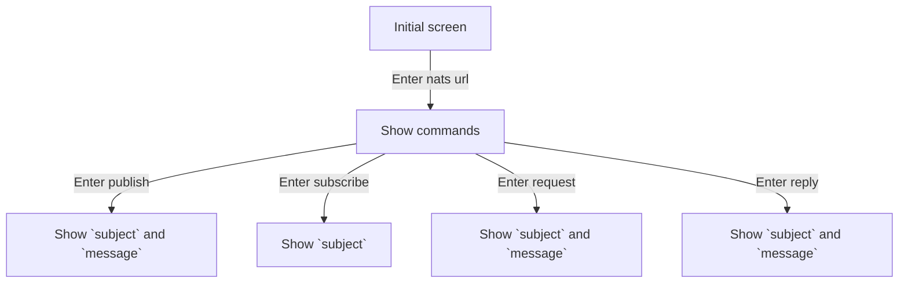

# Nats Terminal User Interface

- No Ai
- Use bubble tea
- Interactive CLI

## Commands

- Publish
- Subscribe
- Request
- Reply

## UI Flow

## Tasks

- ✅ Setup initial terminal UI
- ✅ Get nats url
- ▶️ Show commands
- ⬜ Publish
- ⬜ Subscribe
- ⬜ Request
- ⬜ Reply
